# 🏥 Kidney Defect Detector

> A deep learning solution for automated classification of kidney abnormalities from CT scan images using transfer learning and advanced neural networks.
> The Deployed App ([ https://kidneydefectdetector-nwfae8vpevbpcd5qfehyaw.streamlit.app ])

---

## 🎯 Overview

This repository contains a Jupyter Notebook (`kidney-defect-detector.ipynb`) implementing a state-of-the-art deep learning model for classifying kidney defects from CT scan images. The model leverages transfer learning with a pre-trained **ResNet50** backbone, fine-tuned on a dataset of **12,464 CT kidney scans**, to categorize images into four clinically relevant classes:

- **Normal** – Healthy kidney tissue
- **Cyst** – Benign fluid-filled sacs
- **Tumor** – Malignant neoplasms
- **Stone** – Calcifications and lithiasis

The notebook provides a complete pipeline, including data loading, preprocessing, augmentation, model training, evaluation, and visualization, making it suitable for educational, research, and clinical applications.

---

## ✨ Features

- **End-to-End Pipeline**: From data ingestion to model inference
- **Transfer Learning**: Utilizes pre-trained ResNet50 for robust feature extraction
- **Data Augmentation**: Advanced image transformations to enhance model generalization
- **Class Balancing**: Weighted loss functions to address dataset imbalance
- **Training Optimization**: Early stopping and learning rate scheduling for efficient convergence
- **Comprehensive Evaluation**: Precision, recall, F1-score, and confusion matrix analysis
- **Visualization**: Sample images, training curves, and performance metrics
- **Production-Ready**: Model serialization and inference pipeline for real-world use

---

## 📊 Dataset

The project uses the **[CT-KIDNEY-DATASET-Normal-Cyst-Tumor-Stone](https://www.kaggle.com/datasets/nazmul0087/ct-kidney-dataset-normal-cyst-tumor-and-stone)** from Kaggle, a curated collection of annotated CT scans.

### Dataset Composition

| Class  | Count  | Proportion |
|--------|--------|------------|
| Normal | ~5,000 | 40.1%      |
| Cyst   | ~3,700 | 29.7%      |
| Tumor  | ~2,200 | 17.6%      |
| Stone  | ~1,300 | 10.4%      |
| **Total** | **12,464** | **100%** |

### Dataset Specifications

- **Format**: JPG images with metadata in `kidneyData.csv`
- **Resolution**: Standardized to 224×224×3 (RGB)
- **Train/Validation Split**: 80/20 (~9,571 training, ~2,393 validation images)
- **Source**: [Kaggle Dataset](https://www.kaggle.com/datasets/nazmul0087/ct-kidney-dataset-normal-cyst-tumor-and-stone)
- **Attribution**: Curated by [Nazmul Hasan](https://www.kaggle.com/nazmul0087)

**Note**: A Kaggle account and API token are required for dataset access outside Kaggle environments.

---

## 🧠 Model Architecture

### Base Architecture

- **Backbone**: ResNet50 (pre-trained on ImageNet, frozen layers)
- **Input**: 224×224×3 RGB images
- **Purpose**: Feature extraction for kidney-specific patterns

```mermaid
graph TD
    A["Input: 224×224×3 Images"] --> B["ResNet50 Base<br/>(Frozen)"]
    B --> C["Flatten Layer"]
    C --> D["Dense Layer<br/>(512 units, ReLU<br/>L2 reg: 0.001)"]
    D --> E["Batch Normalization"]
    E --> F["Dropout Layer<br/>(rate: 0.5)"]
    F --> G["Output Dense Layer<br/>(4 units, Softmax)"]
    G --> H["Output: Class Probabilities<br/>[Cyst, Normal, Stone, Tumor]"]
```

### Training Configuration

#### Model Compilation

- **Optimizer**: Adam (learning rate: 0.0001)
- **Loss Function**: Categorical Crossentropy
- **Metrics**: Accuracy, Precision, Recall

#### Callbacks

- **Early Stopping**: Monitors validation loss with patience of 10 epochs, prevents overfitting
- **ReduceLROnPlateau**: Reduces learning rate by factor of 0.2 when validation loss plateaus (patience: 5 epochs)

#### Class Weighting

- Computed dynamically to handle dataset imbalance and prevent bias toward majority classes.

## 📈 Performance

The model demonstrates exceptional performance on the validation set with nearly perfect classification accuracy across all kidney pathology categories.

### Classification Metrics

Results from validation set (4,500 images):

| Class | Precision | Recall | F1-Score | Support |
|-------|-----------|--------|----------|---------|
| Cyst | 0.99 | 1.00 | 1.00 | 1,341 |
| Normal | 1.00 | 1.00 | 1.00 | 1,833 |
| Stone | 1.00 | 1.00 | 1.00 | 505 |
| Tumor | 1.00 | 0.99 | 0.99 | 821 |
| **Weighted Avg** | **1.00** | **1.00** | **1.00** | **4,500** |
| **Macro Avg** | **1.00** | **1.00** | **1.00** | **4,500** |

### Overall Metrics

- **Accuracy**: 99.5%+
- **Average Precision**: 1.00
- **Average Recall**: 1.00
- **Macro F1-Score**: 1.00

### Visualizations

- Sample images per class with predictions
- Confusion matrix heatmap
- Training history (accuracy & loss curves)

## 🙏 Acknowledgments

- **Dataset**: [Nazmul Hasan](https://www.kaggle.com/nazmul0087) – Curator of the CT Kidney Dataset on Kaggle
- **Framework**: Built with [TensorFlow](https://www.tensorflow.org/) and [Keras](https://keras.io/)
- **Research**: Inspired by advances in medical image analysis and deep learning
- **Community**: Thanks to all contributors and users

## 📧 Support

For questions, issues, or feedback:
- **Contact**: [ademolashittu01@gmail.com](mailto:ademolashittu01@gmail.com)

## ⭐ Star This Project!

If you find this project useful, please consider starring the repository!
